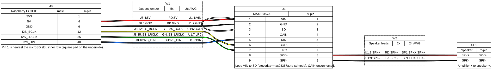

# Chime hardware

CAD, wiring drawing, and build notes for the Chime speaker box.

## Layout

- [`cad/fusion/exports/`](cad/fusion/exports/): STEP exports from Fusion (`Body.step`, `Front_Cover.step`)
- [`variants/rpi0w_lsm104f8/`](variants/rpi0w_lsm104f8/): Raspberry Pi Zero W, MAX98357A, LSM-104F-8

BOM, wiring, assembly, and interface: [variants/rpi0w_lsm104f8/README.md](variants/rpi0w_lsm104f8/README.md).

## Wiring

Drawing source: [`wiring.yml`](wiring.yml). To regenerate the SVG: `wireviz -f s hardware/chime/wiring.yml`.
