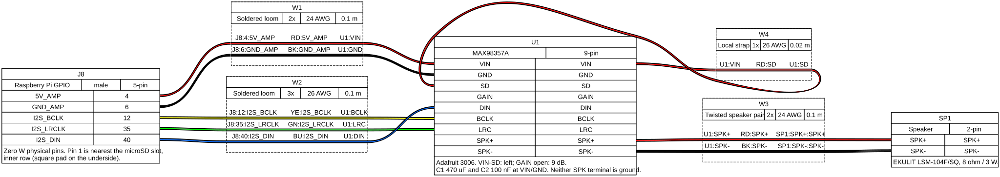

# Chime hardware

Hardware specification for the indoor Chime speaker box: a Raspberry Pi Zero 2 W, a MAX98357A I2S amplifier, and an 8 Ω speaker in a printed 110 × 110 mm housing.

| Document | Owns |
| --- | --- |
| [Electrical interface](variants/rpi02w_lsm104f8/README.md) | Pin assignments, audio levels, firmware requirements |
| [Assembly BOM](bom.md) | Parts, quantities, and harness lengths |
| [Shipped baseline](variants/rpi0w_lsm104f8/README.md) | Shipped Pi Zero W units |

Both variants share the housing: STEP exports in [cad/fusion/exports/](cad/fusion/exports/), print files in [variants/rpi0w_lsm104f8/prints/](variants/rpi0w_lsm104f8/prints/).

## Wiring



Drawing source: [wiring.yml](wiring.yml). Regenerate the committed SVG with WireViz 0.4.1 and Graphviz 14 or newer:

```sh
wireviz -f s hardware/chime/wiring.yml
```
