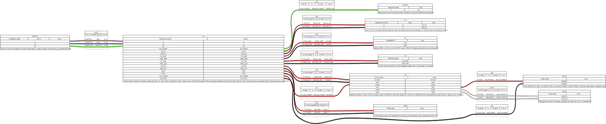
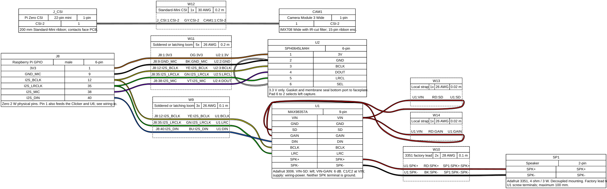
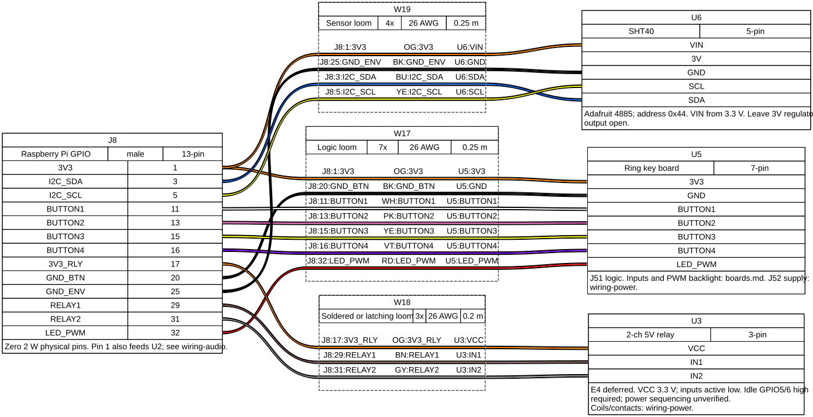

# Ring hardware

Hardware specification for the Raspberry Pi Zero 2 W doorbell with Camera Module 3 Wide, I2S audio, two relays, one to four buttons, and a heated, sealed outdoor enclosure.

Mains enters the 300 × 150 mm enclosure. Two Class II encapsulated modules in a partitioned compartment supply 5 V for the Pi and an isolated 12 V for the strike. Everything outside that compartment is low voltage.

| Document | Contents |
| --- | --- |
| [Electrical interface](variants/rpi02w_cm3/README.md) | Power architecture, mains section, pin assignments, audio, strike, gate, heater, thermal, and firmware requirements |
| [Assembly BOM](bom.md) | Parts, operating ranges, population variants, and estimated harness lengths |
| [Button input circuit](button-input.md) | U5 board: buffered inputs, protection, 5 V distribution, and heater switch |
| [Qualification](qualification.md) | Acceptance criteria, environmental tests, and deferred enclosure decisions |

This is a prototype specification. Relay module verification, antenna keep-out, mains compartment layout, heater sizing, and camera environmental operation remain deferred to enclosure design. Electrical and environmental qualification are pending.

## Wiring

Three drawings show module connections. Component-level connections for U5 are in [button-input.md](button-input.md); other passives are specified in the electrical interface.

Power and strike, source [wiring-power.yml](wiring-power.yml):



Audio and camera, source [wiring-audio.yml](wiring-audio.yml):



Buttons, relays, and sensor, source [wiring-io.yml](wiring-io.yml):



The SVG files are generated and committed so the drawings render here without tooling; `.gitattributes` marks them as generated. Regenerate all three with WireViz 0.4.1 and Graphviz 14.1.2:

```sh
wireviz -f s hardware/ring/wiring-power.yml hardware/ring/wiring-audio.yml hardware/ring/wiring-io.yml
```

The generated `.bom.tsv` files are partial wire reports. [bom.md](bom.md) is the assembly BOM. Hardware checker scripts and CI are outside this design step.
