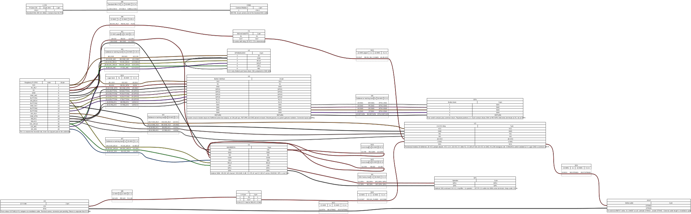

# Ring hardware

Hardware specification for the Raspberry Pi Zero W doorbell with Camera Module 3, I2S audio, two relays, and one to four buttons.

The 300 × 150 mm enclosure contains only low-voltage circuits. Separate indoor adapters supply the Pi and the 12 V strike.

| Document | Contents |
| --- | --- |
| [Electrical interface](variants/rpi0w_cm3/README.md) | Pin assignments, power, audio, strike, and firmware requirements |
| [Assembly BOM](bom.md) | Parts, population variants, and estimated harness lengths |
| [Button input circuit](button-input.md) | Buffered inputs and protection connections |
| [Qualification](qualification.md) | Acceptance criteria and deferred enclosure decisions |

This is a prototype specification. Relay selection and antenna clearance remain deferred to enclosure design. Electrical and environmental qualification are pending.

## Wiring

The drawing shows module connections. Component-level connections for the button board are in [button-input.md](button-input.md); other passives are specified in the electrical interface.

Source: [wiring.yml](wiring.yml). Regenerate with `wireviz -f s hardware/ring/wiring.yml` using WireViz 0.4.1 and Graphviz.

The generated `.bom.tsv` is a partial wire report. [bom.md](bom.md) is the assembly BOM. Hardware checker scripts and CI are outside this design step.
